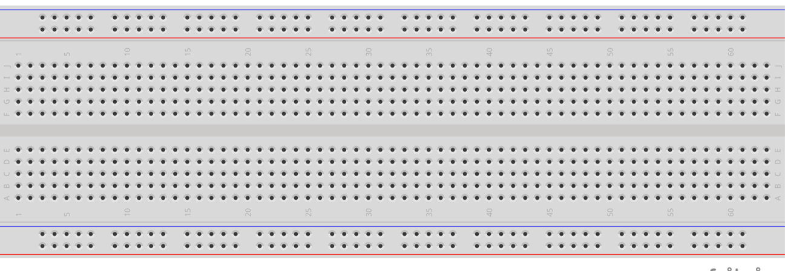

<a href="https://github.com/Alemango/CapstoneIoT" target="blank"></a>

## Descripción:
Asistente virtual, controlado por voz, enfocado en labores de apoyo en salud. Busca apoyar en labores de calendarización, agenda, supervisión, notificación y monitoreo de un paciente.

## Objetivo General:
Supervisar el estado de salud básico de un paciente a distancia, a través del monitoreo constante y la recolección de datos usando sensores.

## Objetivos Específicos:
- Supervisar el estado de salud del paciente.
- Notificar eventos relevantes al responsable del paciente.
- Generar una plataforma web y aplicación móvil, que despliegue los datos recolectados mediante sensores.
- Implementar un asistente controlado por voz.
- Herramienta "Diagnóstico" que permita conocer los cambios en las mediciones con el efecto de un medicamento

## Resultados Esperados:
Esperamos tener un asistente virtual funcional, equipado con las funciones necesarias para agendar, monitorear, notificar y supervisar a un paciente de manera continua y especializada. Una aplicación y Dashboard para poder visualizar e interactuar con la información del paciente. Además de los dispositivos/sensores necesarios para adquirir la mayor cantidad de datos relevantes para el cuidado médico.

## Materiales Necesarios:
<table style="text-align: center; margin: 0 auto;">
    <tr>
        <th>Dispositivo</th>
        <th>Imagen</th>
        <th>Dispositivo</th>
        <th>Imagen</th>
    </tr>
    <tr>
        <td>Computadora (x1)</td>
        <td></td>
        <td>Microcontrolador ESP32 (x1)</td>
        <td></td>
    </tr>
    <tr>
        <td>Sensor MQ-135 (x1)</td>
        <td></td>
        <td>Sensor MAX-30100 (x1)</td>
        <td></td>
    </tr>
    <tr>
        <td>Sensor DHT-11 (x1)</td>
        <td></td>
        <td>Resistencia (220 Ω)</td>
        <td></td>
    </tr>
    <tr>
        <td>Protoboard (x2)</td>
        <td></td>
        <td>Cables</td>
        <td></td>
    </tr>
</table>

## Software Necesario:
<table style="text-align: center; margin: 0 auto;">
    <tr>
        <th>Programa</th>
        <th>Versión</th>
        <th>Programa</th>
        <th>Versión</th>
    </tr>
    <tr>
        <td><br>Visual Studio Code</td>
        <td>1.65.2</td>
        <td><br>Arduino IDE</td>
        <td>1.8.19</td>
    </tr>
    <tr>
        <td><br>Python</td>
        <td>3.9.7</td>
        <td><br>Anaconda</td>
        <td>3.0</td>
    </tr>
    <tr>
        <td><br>Android SDK</td>
        <td>2021.1.1.22</td>
        <td><br>Azure</td>
        <td>Portal</td>
    </tr>
    <tr>
        <td><br>Firebase</td>
        <td>Realtime Database</td>
        <td><br>ThingSpeak</td>
        <td>Online</td>
    </tr>
</table>

## Workflow:


## Instrucciones:
- Haz fork de este repositorio.
```sh
gh repo clone Alemango/CapstoneIoT
```

- Carga el [programa](https://github.com/Alemango/CapstoneIoT/blob/main/Sensores/EMMA.ino) en tu ESP32 usando el Arduino IDE.
```sh
Preferencias -> Gestor de URLs Adicionales de Tarjetas

Pega el siguiente link: https://dl.espressif.com/dl/package_esp32_index.json
```

```sh
Herramientas -> Placa -> ESP32 Arduino

Selecciona: DOIT ESP32 DEVKIT V1
```

```sh
Herramientas -> Upload Speed

Selecciona: 115200
```

- Arma el circuito:


- Crea un proyecto en Firebase 
    - Crea una Realtime Database.
    - Carga los [datos](https://github.com/Alemango/CapstoneIoT/blob/main/Datos%20Gen%C3%A9ricos/emma-asistente-datos.json) de ejemplo.

- Crea una cuenta de [ThingSpeak](https://thingspeak.com/channels).
    - Crea 3 canales (Nombre del Paciente, Promedio, Disparo).
        - Crea 5 campos (BPM, SPO2, Temperatura, Humedad, PPM)
    - Ve a la sección de [MatLab Analysis](https://thingspeak.com/apps/matlab_analyses). Y crea un nuevo script "Custom".
    - Copia y pega el [Script](https://github.com/Alemango/CapstoneIoT/blob/main/Script-ThingSpeak/Script.m).
    - Guarda.
    - Ve a la sección de [React](https://thingspeak.com/apps/reacts/new). 
        - Pon un nombre.
        - **Condition Type:** Numeric.
        - **Test Frecuency:** On data insertion.
        - **Condition:**
            - **If Channel:** Disparo
            - **Field:** 1
            - is equal to
            - 1
        - **Action MatLab Analysis.**
            - **Code to execute:** El Script que acabas de guardar.
        - **Options:** Run action each time condition is met.
    - Guarda.

- Descarga e instala la app.

## Desarrollado:
- [Juan Alemán](https://github.com/Alemango)
